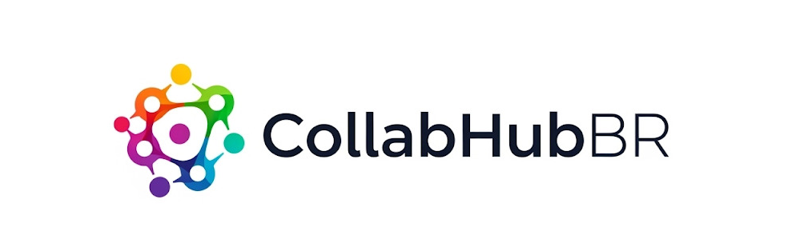

Com a crescente de projetos Open Source com alto engajamento e participação da comunidade vem a necessidade de coordenar os esforços mantendo ainda o engajamento em comunidade. Pensando nisso, criamos o CollabHubBR, uma plataforma Open Source 100% brasileira para coordenação e organização de projetos de código-aberto.

Integrado ao GitHub, o CollabHubBR oferecerá um ferramental completo para organização e tomada de decisões gerenciadas de forma democrática, driven-by-community, com features como:

- Painel kanban público
- Roadmap com etapas futuras
- Enquetes de novas features
- Badges, conquistas e milestones
- Dashboard de métricas
- Seção de comentários em polls

## Stack

Pensado na comunidade, o CollabHubBR é arquitetado em microsserviços, de modo que diferentes pessoas possam contribuir em diferentes linguagens, sendo:

### Front-End

#### Web

- React
- Websockets (Notificações)
- Recharts (Dashboard)

#### Mobile

- React Native
- Websockets (Notificações)

### Back-End

#### Integração com GitHub API

- Linguagem: Python
- Framework: [FastAPI](https://fastapi.tiangolo.com/pt/)
- Database: Postgres
- Responsabilidade: Buscar os dados do repositório para apresentar na página do projeto no CollabHubBR, tanto dados gerais quando informações do dashboard, utilizando a API do GitHub com Chave Privada - se necessário

#### Tracking de Projetos

- Linguagem: TypeScript
- Framework: [Express](https://expressjs.com/pt-br/)
- Database: Postgres
- Responsabilidade: Fazer o tracking de projetos que o usuário marcar como "Follow", semelhantemente ao GitHub; além de listar o que o usuário segue, também chama o serviço de notificações quando há novidades importantes, como nova enquete, roadmap e milestones alcançados

#### Sistema de Badges

- Linguagem: Go
- Framework: [Fiber](https://gofiber.io/)
- Database: Postgres
- Responsabilidade: Associar os devidos badges, conquistas e milestones, tanto dos usuários quanto dos projetos

#### Usuários

- Linguagem: Java
- Framework: [Spring](https://spring.io/projects)
- Database: Postgres
- Responsabilidade: Gerenciar os usuários, perfis, permissões e grupos, conforme autorizações, convites para ADM de projeto no CollabHubBR. Usuários criadores de projetos podem convidar outros usuários para se tornarem ADMs em determinado projeto - superuser (todas as permissões) ou por roles (kanbanRole, pollRole, roadmapRole, ...)

#### Projetos

- Linguagem: Java
- Framework: [Spring](https://spring.io/projects)
- Database: Postgres
- Responsabilidade: Unifica os usuários com os devidos projetos, cuidando também de gerenciar os projetos em si, sendo o core do CollabHubBR

#### Polls/Enquetes

- Linguagem: PHP
- Framework: [Laravel](https://laravel.com/)
- Database: Postgres
- Responsabilidade: CRUDar enquetes por parte dos Adms, assegurar um voto por usuário

#### Comentários

- Linguagem: TypeScript
- Framework: [Express](https://expressjs.com/pt-br/)
- Database: MongoDB
- Responsabilidade: CRUDar comentários, com contato direto com as enquetes, sendo o espaço onde usuários podem comentar sobre a enquete, permitindo CRUD por qualquer usuário, com Adms podendo apagar comentários quaisquer de seus projetos

#### Notificações

- Linguagem: Go
- Framework: [Fiber](https://gofiber.io/)
- Database: Postgres
- Mensageria: Kafka?
- Responsabilidade: Notificar o Front-End dos usuários elegíveis conforme ocorram os eventos de Abertura/Fechamento de Enquete, Marcações, Comentários Respondidos e Conquistas/Milestones/Roadmaps concluidos

#### Roadmap

- Linguagem: Python
- Framework: [FastAPI](https://fastapi.tiangolo.com/pt/)
- Database: Postgres
- Responsabilidade: CRUDar todo o roadmap do projeto, mantendo histórico do que já foi concluído

## Políticas de Comunidade

Antes de contribuir ativamente com o projeto é **fortemente recomendada** a leitura dos documentos abaixo:

- [Código de Conduta](CODE_OF_CONDUCT.md)
- [Contribuindo](CODE_OF_CONDUCT.md)
- [Segurança](SECURITY.md)
- [Suporte](SUPPORT.md)

